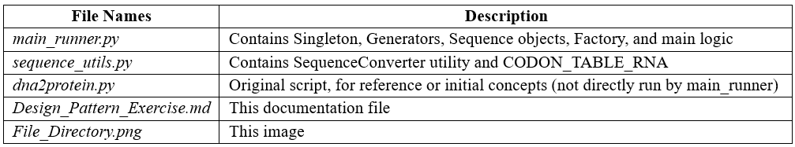

# Design Pattern Coding Exercises I & II 

### Introduction
This markdown file explains the solution to the coding exercise "Design Pattern Exercise I & II". The exercises focus on manipulating DNA and protein sequences, progressively introducing software design patterns to enhance code structure, maintainability, and extensibility. The solutions commence with the provided `dna2protein.py` script (representing an initial state) and evolve by implementing utility classes, the Singleton pattern, and the Factory pattern, primarily demonstrated in `main_runner.py` and `sequence_utils.py`.

### 1. Initial Setup and Core Functionality
The conceptual starting point is a script like `dna2protein.py`, which contain basic definitions for sequence operations, storage, and generation. However, for the exercises, we will be focusing on more structured implementations. The core bioinformatics functions involve transcription (DNA to RNA) and translation (RNA to protein).

**1.1. Implementing Transcription and Translation (as per `sequence_utils.py`)**
Transcription converts a DNA sequence into an RNA sequence by replacing Thymine (T) with Uracil (U). Translation converts an RNA sequence into a protein sequence based on codons (triplets of RNA bases). A standard RNA codon table is required for translation.

The `sequence_utils.py` file defines the codon table and conversion utilities:

    | Python code block (from sequence_utils.py) |
    # Standard RNA Codon Table (maps RNA codons to amino acids)
    CODON_TABLE_RNA = {
        'UUU': 'F', 'UUC': 'F', 'UUA': 'L', 'UUG': 'L',
        'UCU': 'S', 'UCC': 'S', 'UCA': 'S', 'UCG': 'S',
        'UAU': 'Y', 'UAC': 'Y', 'UAA': '*', 'UAG': '*',  # '*' are stop codons
        'UGU': 'C', 'UGC': 'C', 'UGA': '*', 'UGG': 'W',
        'CUU': 'L', 'CUC': 'L', 'CUA': 'L', 'CUG': 'L',
        'CCU': 'P', 'CCC': 'P', 'CCA': 'P', 'CCG': 'P',
        'CAU': 'H', 'CAC': 'H', 'CAA': 'Q', 'CAG': 'Q',
        'CGU': 'R', 'CGC': 'R', 'CGA': 'R', 'CGG': 'R',
        'AUU': 'I', 'AUC': 'I', 'AUA': 'I', 'AUG': 'M',  # Methionine, also start codon
        'ACU': 'T', 'ACC': 'T', 'ACA': 'T', 'ACG': 'T',
        'AAU': 'N', 'AAC': 'N', 'AAA': 'K', 'AAG': 'K',
        'AGU': 'S', 'AGC': 'S', 'AGA': 'R', 'AGG': 'R',
        'GUU': 'V', 'GUC': 'V', 'GUA': 'V', 'GUG': 'V',
        'GCU': 'A', 'GCC': 'A', 'GCA': 'A', 'GCG': 'A',
        'GAU': 'D', 'GAC': 'D', 'GAA': 'E', 'GAG': 'E',
        'GGU': 'G', 'GGC': 'G', 'GGA': 'G', 'GGG': 'G',
    }
    # Note: The actual transcription and translation functions will be part of SequenceConverter class.

The transcription and translation functions will operate on string representations of sequences and are implemented as static methods in the `SequenceConverter` class (see Section 2.2).

### 2. Exercise Solutions

**2.1. Question 1**: Translate the given DNA sequence into a protein sequence.

Implementation:
We use the `SequenceConverter` utility class from `sequence_utils.py` which contains the necessary static methods.

    | Python code block (illustrative, actual call in main_runner.py) |
    # In the main execution block (e.g., if __name__ == "__main__": in main_runner.py)
    # from sequence_utils import SequenceConverter
    
    dna_sequence_given = "GTGGCATTGTAATGGGCTCCGAAAGGGTGCCCGATAG" # Corrected from original for typical example
    print(f"Original DNA Sequence: {dna_sequence_given}")
    
    rna_sequence = SequenceConverter.transcribe_dna_to_rna(dna_sequence_given)
    print(f"Transcribed RNA Sequence: {rna_sequence}")
    
    protein_sequence = SequenceConverter.translate_rna_to_protein(rna_sequence)
    print(f"Translated Protein Sequence: {protein_sequence}")
    # Expected for GTG GCC ATT GTA ATG GGC CGC TGA AAG GGT GCC CGA TAG
    # RNA: GUG GCC AUU GUA AUG GGC CGC UGA AAG GGU GCC CGA UAG
    # Protein: VAIVMGR (translation stops at UGA)

This step demonstrates the fundamental bioinformatics process using the core functions from `SequenceConverter`.

**2.2. Question 2**: Create a utility class, which contains both methods as static methods.

Concept: Utility Class
A utility class groups related static methods and is not meant to be instantiated. This organizes helper functions into a logical namespace.

Implementation:
The class `SequenceConverter` in `sequence_utils.py` houses `transcribe_dna_to_rna` and `translate_rna_to_protein` as static methods. The `CODON_TABLE_RNA` is defined in the same file and used by `translate_rna_to_protein`.

    | Python code block (from sequence_utils.py) |
    # Design_Pattern_Exercise/sequence_utils.py
    
    # Standard RNA Codon Table (for manual translation)
    CODON_TABLE_RNA = {
        # ... (codon table as defined previously) ...
        'GAU': 'D', 'GAC': 'D', 'GAA': 'E', 'GAG': 'E',
        'GGU': 'G', 'GGC': 'G', 'GGA': 'G', 'GGG': 'G',
    }
    
    class SequenceConverter:
        """
        Q2: Utility class for sequence operations.
        Contains methods for transcribing DNA to RNA and translating RNA to protein.
        """
    
        @staticmethod
        def transcribe_dna_to_rna(dna_sequence: str) -> str:
            """Converts a DNA sequence string to an RNA sequence string."""
            if not isinstance(dna_sequence, str):
                raise TypeError("Input DNA sequence must be a string.")
            return dna_sequence.upper().replace('T', 'U')
    
        @staticmethod
        def translate_rna_to_protein(rna_sequence: str) -> str:
            """
            Translates an RNA sequence string to a protein sequence string.
            The translation stops at the first stop codon.
            Unknown codons are translated as 'X'.
            """
            if not isinstance(rna_sequence, str):
                raise TypeError("Input RNA sequence must be a string.")
    
            protein_parts = []
            rna_upper = rna_sequence.upper()
    
            for i in range(0, len(rna_upper) - (len(rna_upper) % 3), 3):
                codon = rna_upper[i:i + 3]
                if len(codon) < 3: # Should not happen with the range step
                    break
                amino_acid = CODON_TABLE_RNA.get(codon, 'X') # 'X' for unknown
                if amino_acid == '*':  # Stop codon found
                    break
                protein_parts.append(amino_acid)
            
            protein_final_sequence = "".join(protein_parts)
            return protein_final_sequence
    
    # Example usage (as in main_runner.py):
    # from sequence_utils import SequenceConverter
    #
    # dna_seq = "ATGCGTAG"
    # rna_seq = SequenceConverter.transcribe_dna_to_rna(dna_seq)
    # protein_seq = SequenceConverter.translate_rna_to_protein(rna_seq)
    # print(f"Utility RNA: {rna_seq}, Protein: {protein_seq}")

This refactoring centralizes sequence conversion logic.

**2.3. Question 3**: Store the sequence into an object of the class `SequenceStorage`.

Implementation:
The `SequenceStorage` class (defined in `main_runner.py`) uses a dictionary to store sequences by name.

    | Python code block (illustrative, from main_runner.py) |
    # In main_runner.py or similar execution context:
    # Assumes SequenceStorage is defined
    # Assumes protein_sequence is available from Question 1
    
    # storage = SequenceStorage() # Instantiation (Singleton behavior discussed next)
    # storage.save("protein_seq_q1", protein_sequence)
    # print(f"Saved 'protein_seq_q1' to storage.")
    # retrieved_sequence = storage.read("protein_seq_q1")
    # print(f"Retrieved from storage: {retrieved_sequence}")

This step introduces basic in-memory state management.

**2.4. Question 4**: Change the class `SequenceStorage` in a way that only one object could exist. Which design pattern could be used?

Identifying the Pattern: Singleton
The Singleton design pattern ensures a class has only one instance and provides a global point of access to it.

Implementation of `SequenceStorage` as a Singleton:
The `SequenceStorage` class in `main_runner.py` is implemented as a Singleton by overriding `__new__` and using a class-level `_instance` variable. It also includes logic to ensure `__init__` effectively runs once.

    | Python code block (from main_runner.py) |
    # In main_runner.py
    
    class SequenceStorage:
        """
        Q3: Stores sequences.
        Q4: Implemented as a Singleton to ensure only one instance exists.
        """
        _instance = None
    
        def __new__(cls, *args, **kwargs):
            if not cls._instance:
                cls._instance = super(SequenceStorage, cls).__new__(cls, *args, **kwargs)
            return cls._instance
    
        def __init__(self):
            if not hasattr(self, '_initialized'): # Ensure init only runs once
                self.data = {}
                self._initialized = True
                print("SequenceStorage initialized.")
    
        def save(self, name: str, seq: str):
            self.data[name] = seq
            print(f"Sequence '{name}' saved.")
    
        def read(self, name: str) -> str | None:
            return self.data.get(name)
    
    # Example usage (as in main_runner.py):
    # storage1 = SequenceStorage()
    # storage2 = SequenceStorage()
    #
    # print(f"Are storage1 and storage2 the same object? {storage1 is storage2}") # Expected: True
    # storage1.save("test_seq_singleton", "ACGT")
    # print(f"Sequence read from storage2: {storage2.read('test_seq_singleton')}") # Expected: ACGT

This implementation ensures any attempt to create an instance of `SequenceStorage` returns the same object.

**2.5. Question 5**: Create a random sequence with the `DNASequenceGenerator`.

Implementation:
The `DNASequenceGenerator` class (defined in `main_runner.py`) is used to create random DNA sequences.

    | Python code block (from main_runner.py) |
    # In main_runner.py
    import random
    
    class DNASequenceGenerator:
        """
        Q5: Generates random DNA sequences.
        """
        NUCLEOTIDES = ['A', 'C', 'G', 'T']
    
        def create_sequence(self, length: int) -> str:
            if length <= 0:
                return ""
            return "".join(random.choice(self.NUCLEOTIDES) for _ in range(length))

    # Example usage (as in main_runner.py):
    # from sequence_utils import SequenceConverter # For processing
    # # SequenceStorage is already defined/imported if running full main_runner.py
    #
    # generator = DNASequenceGenerator()
    # random_dna_seq = generator.create_sequence(50)
    # print(f"Generated Random DNA Sequence (len {len(random_dna_seq)}): {random_dna_seq}")
    #
    # # Optionally process and store this random sequence
    # rna_random = SequenceConverter.transcribe_dna_to_rna(random_dna_seq)
    # protein_random = SequenceConverter.translate_rna_to_protein(rna_random)
    # print(f"Processed Random Protein: {protein_random}")
    #
    # sequence_db = SequenceStorage() # Get the singleton instance
    # sequence_db.save("random_dna_1", random_dna_seq)
    # print(f"Random DNA 1 from storage: {sequence_db.read('random_dna_1')}")

This demonstrates dynamic generation of DNA sequence data.

**2.6. Question 6**: Your program should also work with protein sequences. Extend the code to make that possible.

Conceptual Changes & Implementation:
To handle protein sequences, the system in `main_runner.py` defines a `ProteinSequence` class (inheriting from a base `Sequence` class). `SequenceStorage` can already store any string-based sequence. For creating `ProteinSequence` objects with specific data, the `SequenceFactory` is used (see Q7). A dedicated `ProteinSequenceGenerator` for creating *random* protein sequences is not implemented in the provided `main_runner.py` but could be added similarly to `DNASequenceGenerator` if needed.

    | Python code block (Sequence classes from main_runner.py) |
    # In main_runner.py
    
    class Sequence:
        """Base class for biological sequences."""
        def __init__(self, data: str, seq_type: str):
            self.data = data
            self.seq_type = seq_type
    
        def __str__(self):
            return f"{self.seq_type} Sequence: {self.data}"
    
    class DNASequence(Sequence):
        """Represents a DNA sequence."""
        def __init__(self, data: str):
            super().__init__(data.upper(), "DNA")
            if not all(base in "ACGT" for base in self.data):
                raise ValueError("Invalid characters in DNA sequence. Must be A, C, G, or T.")
    
    class ProteinSequence(Sequence):
        """
        Q6: Represents a Protein sequence.
        """
        VALID_AMINO_ACIDS = "ACDEFGHIKLMNPQRSTVWYX*"
    
        def __init__(self, data: str):
            super().__init__(data.upper(), "Protein")
            if not all(aa in self.VALID_AMINO_ACIDS for aa in self.data):
                # Basic validation, can be expanded or made stricter
                pass # print(f"Warning: Protein sequence '{data}' contains potentially non-standard characters.")
    
    # Example usage (as in main_runner.py):
    # # SequenceStorage is available
    # # ProteinSequence objects are typically created via the factory (Q7) or directly:
    #
    # protein_data = "MVLSPADKTNVKAAWGKVGAHAGEYGAEALE"
    # protein_seq_obj = ProteinSequence(protein_data) # Direct instantiation
    # print(f"Created directly: {protein_seq_obj}")
    #
    # sequence_db = SequenceStorage()
    # sequence_db.save("direct_protein_1", protein_seq_obj.data)
    # print(f"Directly created protein from storage: {sequence_db.read('direct_protein_1')}")

The system is extended by adding a `ProteinSequence` class and ensuring `SequenceStorage` can handle it.

**2.7. Question 7**: Create a class `SequenceFactory`, which contains a method to create a sequence. Based on a given flag, the sequence will be a DNA or protein sequence.

Concept: Simple Factory Pattern
A Simple Factory is a class that centralizes object creation logic based on some input. This decouples client code from concrete class instantiation.

Implementation:
The `SequenceFactory` in `main_runner.py` has a static method `create_sequence` that takes a `seq_type` string and sequence `data` to create either `DNASequence` or `ProteinSequence` objects. It does *not* generate random sequences.

    | Python code block (SequenceFactory from main_runner.py) |
    # In main_runner.py
    # (Sequence, DNASequence, ProteinSequence classes defined above)
    
    class SequenceFactory:
        """
        Q7: Factory for creating DNA or Protein sequence objects from existing data.
        """
        @staticmethod
        def create_sequence(seq_type: str, data: str) -> Sequence | None:
            """
            Creates a sequence object based on the type and provided data.
            :param seq_type: "dna" or "protein"
            :param data: The sequence string
            :return: DNASequence or ProteinSequence object, or None if type is invalid
            """
            if seq_type.lower() == "dna":
                return DNASequence(data)
            elif seq_type.lower() == "protein":
                return ProteinSequence(data)
            else:
                print(f"Error: Unknown sequence type '{seq_type}'. Cannot create sequence.")
                return None
    
    # Example usage (as in main_runner.py):
    # # SequenceStorage is available
    #
    # # Create sequences using the factory with provided data
    # dna_obj_factory = SequenceFactory.create_sequence("dna", "GATTACA")
    # if dna_obj_factory:
    #     print(f"Factory created: {dna_obj_factory}")
    #     # sequence_db.save("factory_dna_data_1", dna_obj_factory.data)
    #
    # protein_obj_factory = SequenceFactory.create_sequence("protein", "MGRVA")
    # if protein_obj_factory:
    #     print(f"Factory created: {protein_obj_factory}")
    #     # sequence_db.save("factory_protein_data_1", protein_obj_factory.data)
    #
    # # Attempt to create an invalid type
    # invalid_obj = SequenceFactory.create_sequence("lipid", "CHCHCH") # Will print error

The `SequenceFactory` centralizes the creation of `DNASequence` and `ProteinSequence` objects from existing data strings.

### 3. Final Project Structure and Code
The application is primarily structured into two Python files: `sequence_utils.py` for conversion utilities and `main_runner.py` for core classes, design pattern implementations, and demonstration.

**3.1. Final Project File Structure**

