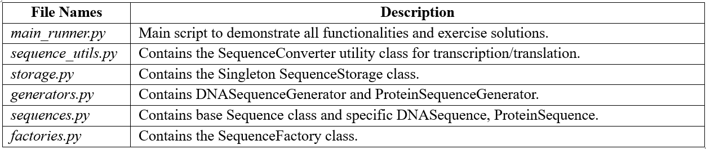

# Introduction 
This markdown file explains the solution to the coding exercise "Design Pattern Exercise I & II". The exercises focus on manipulating DNA and protein sequences, progressively introducing software design patterns to enhance code structure, maintainability, and extensibility. The solutions commence with the provided dna2protein.py script and evolve by implementing utility classes, the Singleton pattern, and the Factory pattern.

### 1. Initial Setup and Core Functionality - The starting point is the dna2protein.py script, which contains definitions for SequenceStorage and DNASequenceGenerator, as well as placeholders for transcribe_dna_to_rna and translate_rna_to_protein.

**1.1. Implementing Transcription and Translation**
Transcription converts a DNA sequence into an RNA sequence by replacing Thymine (T) with Uracil (U). Translation converts an RNA sequence into a protein sequence based on codons (triplets of RNA bases). A standard RNA codon table is required for translation.
The following Python dictionary represents the standard RNA codon table mapping RNA codons to amino acid codes. Stop codons are represented by '*'.

    | ////////// Python code block \\\\\\\\\\ |
    # Standard RNA Codon Table (maps RNA codons to amino acids)
    CODON_TABLE = {
        'AUA':'I', 'AUC':'I', 'AUU':'I', 'AUG':'M',
        'ACA':'T', 'ACC':'T', 'ACG':'T', 'ACU':'T',
        'AAC':'N', 'AAU':'N', 'AAA':'K', 'AAG':'K',
        'AGC':'S', 'AGU':'S', 'AGA':'R', 'AGG':'R',
        'CUA':'L', 'CUC':'L', 'CUG':'L', 'CUU':'L',
        'CCA':'P', 'CCC':'P', 'CCG':'P', 'CCU':'P',
        'CAC':'H', 'CAU':'H', 'CAA':'Q', 'CAG':'Q',
        'CGA':'R', 'CGC':'R', 'CGG':'R', 'CGU':'R',
        'GUA':'V', 'GUC':'V', 'GUG':'V', 'GUU':'V',
        'GCA':'A', 'GCC':'A', 'GCG':'A', 'GCU':'A',
        'GAC':'D', 'GAU':'D', 'GAA':'E', 'GAG':'E',
        'GGA':'G', 'GGC':'G', 'GGG':'G', 'GGU':'G',
        'UCA':'S', 'UCC':'S', 'UCG':'S', 'UCU':'S',
        'UUC':'F', 'UUU':'F', 'UUA':'L', 'UUG':'L',
        'UAC':'Y', 'UAU':'Y', 'UAA':'*', 'UAG':'*',
        'UGC':'C', 'UGU':'C', 'UGA':'*', 'UGG':'W',
    }

The transcription and translation functions will operate on string representations of sequences.

    | ////////// Python code block \\\\\\\\\\ |
    
    import random
    
    # (CODON_TABLE defined above)
    
    def transcribe_dna_to_rna(dna_sequence: str) -> str:
        """Converts a DNA sequence to an RNA sequence."""
        return dna_sequence.upper().replace('T', 'U')
    
    def translate_rna_to_protein(rna_sequence: str) -> str:
        """Translates an RNA sequence into a protein sequence."""
        protein =
        rna_sequence = rna_sequence.upper()
        for i in range(0, len(rna_sequence) - (len(rna_sequence) % 3), 3):
            codon = rna_sequence[i:i+3]
            amino_acid = CODON_TABLE.get(codon, '?') # '?' for unknown codons
            if amino_acid == '*' and i+3 < len(rna_sequence): # Stop codon before end
                 protein.append(amino_acid) # Include stop codon if desired
                 break # Stop translation
            protein.append(amino_acid)
            if amino_acid == '*': # Stop codon at the end
                break
        return "".join(protein)
    
    # Classes from the initial dna2protein.py
    class SequenceStorage:
        def __init__(self):
            self.data = {}
    
        def save(self, name, seq):
            self.data[name] = seq
    
        def read(self, name):
            return self.data[name]
    
    class DNASequenceGenerator:
        alphabet =
        def create_sequence(self, n: int) -> str:
            result = ''
            for _ in range(n):
                # Corrected from 'random.randint(0, a: 3)'
                idx = random.randint(0, len(DNASequenceGenerator.alphabet) - 1)
                result = result + DNASequenceGenerator.alphabet[idx]
            return result

This initial setup allows us to proceed with the exercises. The DNASequenceGenerator has been corrected to use random.randint(0, len(DNASequenceGenerator.alphabet) - 1) for robust index generation.

### 2. Exercise Solutions
**2.1. Question 1**: Translate the given DNA sequence into a protein sequence by using the given code (transcribe_dna_to_rna and translate_rna_to_protein).

Implementation:
Using the functions defined in section 1.1, a given DNA sequence can be processed. We use the simple DNA sequence: GTGGCATTGTAATGGGCTCCGAAAGGGTGCCCGATAG.

    | ////////// Python code block \\\\\\\\\\ |
    # In the main execution block (e.g., if __name__ == "__main__":)
    # (Assumes CODON_TABLE, transcribe_dna_to_rna, translate_rna_to_protein are defined)
    
    dna_sequence_given = "GTGGCATTGTAATGGGCTCCGAAAGGGTGCCCGATAG"
    print(f"Original DNA Sequence: {dna_sequence_given}")
    
    rna_sequence = transcribe_dna_to_rna(dna_sequence_given)
    print(f"Transcribed RNA Sequence: {rna_sequence}")
    
    protein_sequence = translate_rna_to_protein(rna_sequence)
    print(f"Translated Protein Sequence: {protein_sequence}")

This step demonstrates the fundamental bioinformatics process using the core functions. The output will show the transformation from DNA to RNA, and then to a protein sequence. The process relies on the correctness of the CODON_TABLE and the logic within the transcription and translation functions.

**2.2. Question 2**: Create a utility class, which contains both methods as static methods.

Concept: Utility Class
A utility class groups related static methods. It is not meant to be instantiated. This organizes helper functions into a logical namespace, improving code readability and maintainability.

Implementation:
A new class, SequenceConverter, will house transcribe_dna_to_rna and translate_rna_to_protein as static methods. The CODON_TABLE can be a class-level attribute or remain global, though encapsulating it within the class or making it accessible to the class methods is cleaner.

    | ////////// Python code block \\\\\\\\\\ |
    # sequence_utils.py (New File)
    CODON_TABLE_UTIL = { # Renamed to avoid conflict if run in same scope as previous global
        'AUA':'I', 'AUC':'I', 'AUU':'I', 'AUG':'M',
        'ACA':'T', 'ACC':'T', 'ACG':'T', 'ACU':'T',
        #... (rest of the codon table as defined previously)
        'UGC':'C', 'UGU':'C', 'UGA':'*', 'UGG':'W',
    }
    
    class SequenceConverter:
        @staticmethod
        def transcribe_dna_to_rna(dna_sequence: str) -> str:
            """Converts a DNA sequence to an RNA sequence."""
            return dna_sequence.upper().replace('T', 'U')
    
        @staticmethod
        def translate_rna_to_protein(rna_sequence: str) -> str:
            """Translates an RNA sequence into a protein sequence."""
            protein =
            rna_sequence = rna_sequence.upper()
            for i in range(0, len(rna_sequence) - (len(rna_sequence) % 3), 3):
                codon = rna_sequence[i:i+3]
                amino_acid = CODON_TABLE_UTIL.get(codon, '?')
                if amino_acid == '*' and i+3 < len(rna_sequence):
                     protein.append(amino_acid)
                     break
                protein.append(amino_acid)
                if amino_acid == '*':
                    break
            return "".join(protein)
    
    # Example usage (in main script):
    # from sequence_utils import SequenceConverter
    #
    # dna_seq = "ATGCGTAG"
    # rna_seq = SequenceConverter.transcribe_dna_to_rna(dna_seq)
    # protein_seq = SequenceConverter.translate_rna_to_protein(rna_seq)
    # print(f"Utility RNA: {rna_seq}, Protein: {protein_seq}")

This refactoring centralizes sequence conversion logic, making the main script cleaner and the conversion functions easily accessible via SequenceConverter.method_name().

**2.3. Question 3**: Store the sequence into an object of the class SequenceStorage.

Implementation:
The SequenceStorage class uses a dictionary to store sequences by name. We will instantiate it and use its save and read methods.

    | ////////// Python code block \\\\\\\\\\ |
    # In the main execution block (e.g., if __name__ == "__main__":)
    # (Assumes SequenceStorage is defined or imported)
    # (Assumes protein_sequence is available from Question 1)
    
    # Instantiate SequenceStorage
    storage = SequenceStorage()
    
    # Save the protein sequence
    storage.save("protein_seq_1", protein_sequence)
    print(f"Saved 'protein_seq_1' to storage.")
    
    # Read and verify
    retrieved_sequence = storage.read("protein_seq_1")
    print(f"Retrieved from storage: {retrieved_sequence}")
    
    if retrieved_sequence == protein_sequence:
        print("Storage and retrieval successful.")
    else:
        print("Storage and retrieval failed.")

This step introduces basic in-memory state management. The SequenceStorage object acts as a simple cache or database for sequences generated or processed during the program's execution.

**2.4. Question 4**: Change the class SequenceStorage in a way that only one object could exist. Which design pattern could be used?

Identifying the Pattern: Singleton
The Singleton design pattern is appropriate here. Its intent is to "ensure that a class has only one instance, while providing a global access point to this instance". This directly matches the requirement for SequenceStorage.   

Concept of the Singleton Pattern:
The Singleton pattern restricts the instantiation of a class to a single object. This is useful for managing shared resources like database connections, configuration settings, or a centralized cache, as is the case with SequenceStorage. It typically involves a private constructor and a static method that returns the sole instance, creating it on first call (lazy initialization).   

In Python, Singletons can be implemented using various methods, including a base class, a decorator, or a metaclass. The metaclass approach is often considered robust and Pythonic.   

Implementation of SequenceStorage as a Singleton:
The SequenceStorage class will be modified using a metaclass to enforce the Singleton behavior.

    | ////////// Python code block start \\\\\\\\\\ |
    # storage.py (New File or update existing SequenceStorage definition)
    class SingletonMeta(type):
        """
        A metaclass for creating Singleton classes. Ensures only one instance
        of a class exists.
        """
        _instances = {}
    
        def __call__(cls, *args, **kwargs):
            if cls not in cls._instances:
                instance = super().__call__(*args, **kwargs)
                cls._instances[cls] = instance
            return cls._instances[cls]
    
    class SequenceStorage(metaclass=SingletonMeta):
        def __init__(self):
            """
            Private constructor, typically. In Python, the metaclass handles
            the instance creation control. Initialize data storage.
            """
            # Ensure __init__ is only effectively run once by the metaclass logic
            # or add a check if complex initialization is needed.
            # For this simple dictionary, it's fine.
            self.data = {}
            print("SequenceStorage initialized (or instance returned)") # For demonstration
    
        def save(self, name: str, seq: str):
            self.data[name] = seq
    
        def read(self, name: str) -> str:
            return self.data.get(name) # Use.get() for safer access
    
    # Example usage (in main script):
    # from storage import SequenceStorage
    #
    # storage1 = SequenceStorage()
    # storage2 = SequenceStorage()
    #
    # print(f"Are storage1 and storage2 the same object? {id(storage1) == id(storage2)}")
    #
    # storage1.save("test_seq", "ACGT")
    # print(f"Sequence read from storage2: {storage2.read('test_seq')}")

This implementation ensures that any attempt to create an instance of SequenceStorage will return the same object. 

**2.5. Question 5**: Create a random sequence with the DNASequenceGenerator.

Reviewing and Correcting DNASequenceGenerator:
The DNASequenceGenerator class has a minor syntax error in random.randint(0, a: 3). This should be random.randint(0, 3) or, more robustly, random.randint(0, len(DNASequenceGenerator.alphabet) - 1).

Implementation:
We will use the corrected DNASequenceGenerator.

    | ////////// Python code block start \\\\\\\\\\ |
    # generators.py (New File, or update existing DNASequenceGenerator definition)
    import random
    
    class DNASequenceGenerator:
        alphabet =
    
        def create_sequence(self, n: int) -> str:
            """Creates a random DNA sequence of length n."""
            if n <= 0:
                return ""
            # Corrected random index generation
            return "".join(random.choice(DNASequenceGenerator.alphabet) for _ in range(n))
    
    # Example usage (in main script):
    # from generators import DNASequenceGenerator
    # from storage import SequenceStorage # Assuming Singleton SequenceStorage
    # from sequence_utils import SequenceConverter # Assuming Utility class
    #
    # dna_gen = DNASequenceGenerator()
    # random_dna_seq = dna_gen.create_sequence(50)
    # print(f"Generated Random DNA Sequence (len {len(random_dna_seq)}): {random_dna_seq}")
    #
    # # Optionally process and store this random sequence
    # random_rna_seq = SequenceConverter.transcribe_dna_to_rna(random_dna_seq)
    # random_protein_seq = SequenceConverter.translate_rna_to_protein(random_rna_seq)
    # print(f"Processed Random Protein: {random_protein_seq}")
    #
    # sequence_db = SequenceStorage() # Get the singleton instance
    # sequence_db.save("random_dna_1", random_dna_seq)
    # sequence_db.save("random_protein_1", random_protein_seq)
    # print(f"Random DNA 1 from storage: {sequence_db.read('random_dna_1')}")

The create_sequence method was also improved to use random.choice and "".join() for better performance and readability in generating the sequence string. This step demonstrates the ability to dynamically generate input data, which is essential for testing and simulation in many scientific applications.

**2.6. Question 6**: Your program should also work with protein sequences. Extend the code to make that possible.

Conceptual Changes:
To handle protein sequences, the system needs to:

Recognize protein sequences (which are strings of amino acid codes).
Optionally, have a way to generate random protein sequences.
Ensure existing components like SequenceStorage can handle them (which it already can, as it stores strings).
Implementation:
A protein alphabet will be defined. A ProteinSequenceGenerator can be created, similar to DNASequenceGenerator.

    | ////////// Python code block \\\\\\\\\\ |
    # generators.py (Extend this file)
    # (DNASequenceGenerator class as defined before)
    
    class ProteinSequenceGenerator:
        # Standard 20 amino acids + '*' for stop codon.
        # For random generation, typically exclude stop codons unless specifically needed.
        alphabet =
    
        def create_sequence(self, n: int) -> str:
            """Creates a random protein sequence of length n."""
            if n <= 0:
                return ""
            return "".join(random.choice(ProteinSequenceGenerator.alphabet) for _ in range(n))
    
    # Example usage (in main script):
    # from generators import ProteinSequenceGenerator
    # from storage import SequenceStorage
    #
    # protein_gen = ProteinSequenceGenerator()
    # random_protein_seq_direct = protein_gen.create_sequence(30)
    # print(f"Generated Random Protein Sequence (len {len(random_protein_seq_direct)}): {random_protein_seq_direct}")
    #
    # sequence_db = SequenceStorage() # Get the singleton instance
    # sequence_db.save("random_protein_direct_1", random_protein_seq_direct)
    # print(f"Random Protein (direct) from storage: {sequence_db.read('random_protein_direct_1')}")

This extension demonstrates the system's adaptability. The SequenceStorage (being a Singleton) can seamlessly store these new protein sequences alongside DNA sequences. The introduction of ProteinSequenceGenerator mirrors the structure of DNASequenceGenerator, promoting consistency. This prepares the ground for a more abstract way of creating sequences, which is addressed by the Factory pattern in the next question.

**2.7. Question 7**: Create a class SequenceFactory, which contains a method to create a sequence. Based on a given flag, the sequence will be a DNA or protein sequence.

Concept: Factory Pattern
The Factory Method pattern defines an interface for creating an object, but lets subclasses decide which class to instantiate. A simpler variant, often just called a Simple Factory, is a class that centralizes object creation logic based on some input (like a flag). This decouples the client code from concrete class instantiation, making the system more flexible and easier to extend with new product types.

Implementation:
To better illustrate the factory's role, simple wrapper classes for different sequence types (DNASequence, ProteinSequence) will be introduced. These could hold the sequence data and its type.

    | ////////// Python code block \\\\\\\\\\ |
    # sequences.py (New File)
    class Sequence:
        def __init__(self, data: str, seq_type: str):
            self.data = data
            self.type = seq_type
    
        def __str__(self):
            return f"Type: {self.type}, Sequence: {self.data}"
    
        def get_data(self) -> str:
            return self.data
    
        def get_type(self) -> str:
            return self.type
    
    class DNASequence(Sequence):
        def __init__(self, data: str):
            super().__init__(data, "DNA")
        # Potential DNA-specific methods can be added here
    
    class ProteinSequence(Sequence):
        def __init__(self, data: str):
            super().__init__(data, "Protein")
        # Potential Protein-specific methods can be added here

Now, the SequenceFactory can create instances of these specific sequence classes.

    | ////////// Python code block \\\\\\\\\\ |
    
    # factories.py (New File)
    from sequences import Sequence, DNASequence, ProteinSequence
    from generators import DNASequenceGenerator, ProteinSequenceGenerator # Assuming these are in generators.py
    
    class SequenceFactory:
        def __init__(self):
            self._dna_generator = DNASequenceGenerator()
            self._protein_generator = ProteinSequenceGenerator()
    
        def create_sequence(self, sequence_type: str, length: int = 0, data: str = None) -> Sequence:
            """
            Creates a sequence object (DNA or Protein).
            If data is provided, it's used. Otherwise, a random sequence of 'length' is generated.
            """
            sequence_type_upper = sequence_type.upper()
    
            if sequence_type_upper == "DNA":
                if data:
                    return DNASequence(data)
                elif length > 0:
                    return DNASequence(self._dna_generator.create_sequence(length))
                else:
                    raise ValueError("For DNA sequence, provide data or a positive length for generation.")
            elif sequence_type_upper == "PROTEIN":
                if data:
                    return ProteinSequence(data)
                elif length > 0:
                    return ProteinSequence(self._protein_generator.create_sequence(length))
                else:
                    raise ValueError("For Protein sequence, provide data or a positive length for generation.")
            else:
                raise ValueError(f"Unknown sequence type: {sequence_type}. Supported types are 'DNA', 'Protein'.")
    
    # Example usage (in main script):
    # from factories import SequenceFactory
    # from storage import SequenceStorage
    #
    # factory = SequenceFactory()
    # sequence_db = SequenceStorage() # Singleton instance
    #
    # # Create a random DNA sequence using the factory
    # dna_obj_factory = factory.create_sequence(sequence_type="DNA", length=60)
    # print(f"Factory created: {dna_obj_factory}")
    # sequence_db.save("factory_dna_1", dna_obj_factory.get_data())
    #
    # # Create a protein sequence from existing data using the factory
    # existing_protein_data = "MVLSPADKTNVKAAWGKVGAHAGEYGAEALE"
    # protein_obj_factory = factory.create_sequence(sequence_type="Protein", data=existing_protein_data)
    # print(f"Factory created: {protein_obj_factory}")
    # sequence_db.save("factory_protein_1", protein_obj_factory.get_data())
    #
    # # Verify storage
    # print(f"Retrieved factory_dna_1: {sequence_db.read('factory_dna_1')}")
    # print(f"Retrieved factory_protein_1: {sequence_db.read('factory_protein_1')}")

The SequenceFactory encapsulates the logic for creating different types of sequence objects. The client code now interacts with the factory, specifying the desired type and parameters, without needing to know the concrete sequence classes or their specific generator classes. This enhances modularity and makes it easier to introduce new sequence types (e.g., RNA sequences) in the future by modifying only the factory and adding the new sequence class.

### 3. Complete Project Structure and Code
The application has been refactored into several modules, each with a specific responsibility. This modular design improves organization and maintainability.

**3.1. Final Project File Structure**

The Design_Pattern_Exercise directory will contain the following files:

**3.2. Instructions for Running**

1) Ensure Python 3.x is installed.
2) Open a terminal or command prompt, navigate to the Design_Pattern_Exercise directory.
3) Run the main script using the command: python main_runner.py
4) The output will show the results of each exercise step.

